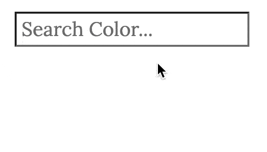

# Typeahead-standalone.js

[](https://www.npmjs.com/package/typeahead-standalone)
[](https://github.com/digitalfortress-tech/typeahead-standalone/actions?query=branch%3Amaster)
[](https://github.com/prettier/prettier)
[](https://www.jsdelivr.com/package/npm/typeahead-standalone)
[](https://npm-stat.com/charts.html?package=typeahead-standalone)

[](https://opensource.org/licenses/MIT)
[](https://twitter.com/acdlite/status/974390255393505280)
[](https://www.paypal.com/donate/?hosted_button_id=PZ5ULVZBZX55A)

---
A fast fully-featured standalone autocomplete library

**🌟 Highlights 🌟**

- 🚀 Blazing fast suggestions and autocompletion
- 📦 Has **0 DEPENDENCIES**! Written in pure JS (typescript)
- 🎀 Framework agnostic! Usable with **any** framework (React, Vue, Svelte, etc)
- 💡 Highly customizable and light-weight [](https://bundlephobia.com/package/typeahead-standalone)
- ⚜️ In-built support for multiple data sources - Local, Prefetch and Remote (requests rate-limited by default)
- ⚡️ Suggestions calculated via a very efficient algorithm based on trie data structure
- ♿️ WAI-ARIA compliant design pattern with support for language diacritics
- 🌐 Supports every major browser!
---

### 🔥 Demo/Docs

Find here **[detailed Docs with Live Demos](https://typeahead.digitalfortress.tech/)** for **typeahead-standalone.js**.

Preview of a basic example:



## <a id="installLink">➕ Install</a>

```shell script
# you can install typeahead with npm
$ npm install --save typeahead-standalone

# Alternatively you can use Yarn
$ yarn add typeahead-standalone
```
Then include the library in your App/Page.

**As a module,**
```javascript
// using ES6 modules
import typeahead from 'typeahead-standalone'; // imports library (js)
import 'typeahead-standalone/dist/basic.css'; // imports basic styles (css)

// using CommonJS modules
const typeahead = require('typeahead-standalone');
require('typeahead-standalone/dist/basic.css');
```

**In the browser context,**
```html
<!-- Include the basic styles & the library -->
<link rel="stylesheet" href="./node_modules/typeahead-standalone/dist/basic.css" />
<script src="./node_modules/typeahead-standalone/dist/typeahead-standalone.umd.js"></script>

<!-- Alternatively, you can use a CDN. For example, use jsdelivr to get the latest version -->
<link rel="stylesheet" href="https://cdn.jsdelivr.net/npm/typeahead-standalone/dist/basic.css" />
<script src="https://cdn.jsdelivr.net/npm/typeahead-standalone"></script>

<!-- or use unpkg.com to get a specific version -->
<link rel="stylesheet" href="https://unpkg.com/typeahead-standalone@4.25.1/dist/basic.css" />
<script src="https://unpkg.com/typeahead-standalone@4.25.1/dist/typeahead-standalone.umd.js"></script>
```
The library will be available as a global object at **`window.typeahead`**

## 🌱 Usage

Typeahead requires an **`input`** Element to attach itself to, and a **`Data source`** (local/remote) to display suggestions.

Here is a very basic example (See [demo](#demo) for advanced examples)

#### Html

```html
<!-- include the library -->
<script src="..." async></script>

<!-- Html markup -->
<input type="search" id="searchInput" autocomplete="off" placeholder="Search...">
```
#### Javascript

```javascript
// local Data
const colors = ['Grey', 'Brown', 'Black', 'Blue'];

// input element to attach to
const inputElement = document.getElementById("searchInput");

typeahead({
    input: inputElement,
    source: {
      local: colors,
      // prefetch: {...}
      // remote: {...}
    }
});
```

## <a id="configoptions">🔧 Configuration</a>


You can pass the following config options to `typeahead-standalone`:

| Parameter | Description | Default |
| --------- | ----------- | ------- |
|`input`|DOM input element must be passed with this parameter and typeahead will attach itself to this field. |`-` (Required)|
|`source`|This is the source of Data from which suggestions will be calculated. The source can be local, prefetched or retrieved from a remote endpoint. [Details](#source) |`-` (Required)|
|`minLength`|Specify the minimum length, when suggestions should appear on the screen.|`1`|
|`limit`|Specify the maximum number of suggestions that should be displayed.|`5`|
|`highlight`| If set to true, the matched letters are highlighted in the list of suggestions. A class `tt-highlight` is added to facilitate styling|`undefined`|
|`autoSelect`| If set to true, pre-selects the first displayed suggestion |`false`|
|`hint`| Updates the input placeholder to be equal to the first matched suggestion. A class `tt-hint` is added to facilitate styling|`true`|
|`diacritics`| Flag to enable/disable language diacritics supported search (i.e. search by converting accented characters into their non-accented counterparts)|`undefined`|
|`className`|The typeahead-standalone container will have this class name (in addition to the default class `typeahead-standalone`) *@deprecated. Will be removed in v5.0. Use classNames config option*|`undefined`|
|`classNames: Object`|The classNames object can be used to set custom classes for every html element that is injected in the DOM. [Details](#classNamesLink) |`undefined`|
|`templates`|An object containing templates for header, footer, suggestion, group and notFound state. See [templates section](#templates) for clarification |`undefined`|
|`debounceRemote`|Delays execution of making Ajax requests (in milliseconds) |`100`|
|`preventSubmit`|If your input element is used inside a form element, this flag allows to prevent the default submit action when the ENTER key is pressed.|`false`|
|`onSubmit(event, selectedItem?)`|When you want to use typeahead outside a form element, this handler can be used to process/submit the input value. Gets triggered on hitting the ENTER key. First parameter is the keyboard Event and the 2nd parameter is the selected item or undefined if no item was selected|`undefined`|
|`display(selectedItem, event?) => string`|This callback is executed when the user selects an item from the suggestions. The current suggestion/item is passed as a parameter and it **must return a string** which is set as the input's value. The 2nd *optional* parameter `event` is a Mouse/Keyboard event which can be used to track user interaction or for analytics. It defaults to `null`. |Returns the string representation of the selected item|

---

### <a id="sourceLink">🔌 Source</a>

This is the source of data from which suggestions will be provided. This is the expected format of the source object.
```
source: {
  local: [],
  remote: {
    url: 'https://remoteapi.com/%QUERY', // OR "url: (inputQuery: string) => `https://remoteapi.com/${inputQuery}`"
    wildcard: '%QUERY',
    requestOptions: {}        // optional, default => undefined
  },
  prefetch: {
    url: 'https://remoteapi.com/load-suggestions', // OR `url: () => string`
    when: 'onFocus',          // optional, default => 'onInit'
    done: false,              // optional, default => false
    process: (items) => void, // optional, default => undefined
    requestOptions: {}        // optional, default => undefined
  },
  identifier: '...',          // optional (required when source => Object[])
  identity: (item) => string, // optional (determines uniqueness of each suggestion)
  dataTokens: ['...'],        // optional
  groupIdentifier: '...',     // optional, default => undefined
  transform: function (data) {
    // modify received data if needed & return it
    return data;
  }
}
```
- **Local**: The `local` data source is used when you want to provide suggestions from a local source like a variable.
- **Prefetch**: The `prefetch` data source is used when you want to preload suggestions from a remote endpoint in advance. You must provide the `url` parameter that points to the endpoint that will return suggestions. You can provide an optional `when` parameter which defines when the prefetch request should occur. It defaults to `onInit` meaning that suggestions will be preloaded as soon as typeahead gets initialized. You can set it to `onFocus` which will cause suggestions to be preloaded only when the user focuses the search input box. The `done` flag is optional & can be used to disable the prefetch request programmatically. Its default value is `false`. It gets set to `true` automatically when data is prefetched for the first time (to prevent multiple network requests). By setting `done: true`, the prefetch request will not occur. An example use-case to do this is when you are using *localStorage* to store suggestions but the *localStorage* already had stored suggestions previously thereby eliminating the need to prefetch data again. The `process(suggestions)` callback is optional. It gets executed after the prefetch request occurs. It receives the transformed suggestions as a parameter & as an example can be used to store the received suggestions in *localStorage* to be used later.
- **Remote**: The `remote` data source is used when you want to interrogate a remote endpoint to fetch data.
- **Wildcard**: While using the `remote` data source, you must set the `url` and the `wildcard` options. `wildcard` will be replaced with the search string while executing the request.
- **RequestOptions**: The [fetch](https://developer.mozilla.org/en-US/docs/Web/API/Fetch_API/Using_Fetch) API is used to query remote endpoints.  You may provide an object of [requestOptions](https://developer.mozilla.org/en-US/docs/Web/API/Fetch_API/Using_Fetch#supplying_request_options) to customize the outgoing request. By default the query type is `GET`.
- **Transform**: You can provide an optional `transform()` function which gets called immediately after the prefetch/remote endpoint returns a response. You can modify the response before it gets processed by typeahead.
- **Identifier**: An `identifier` is required when the data source is an array of objects. An `identifier` is used to identify which property of the object should be used as the text for displaying the suggestions. For example, lets say the data source is something like this:
```javascript
/* Example Data source */
[
  { id: 1, color: "Yellow", colorCode: "YW" },
  { id: 2, color: "Green", colorCode: "GN", shade: "Greenish" },
  { id: 3, color: "Olive", colorCode: "OV", shade: "Greenish" },
  ...
]
 ```
 Now if we wish to use the the text defined in the `color` property to appear as the suggestions, then the **identifier** must be set to **color**. (i.e. `identifier: "color"`)
- **dataTokens**: `dataTokens: string[]` is an _optional_ property. It accepts an array of strings which represent the properties of the source object that should be added to the search index. This can be best understood with an example. Lets take the same example data source as shown above. What if you wanted to search colors by another property(_colorCode_) and not just by its identifier(_color_) ? That's exactly where **dataTokens** comes in. Set `dataTokens: ["colorCode"]`. If you now search for "**YW**", the suggestion "Yellow" pops up as expected.
- **groupIdentifier**: If you wish to group your suggestions, set the groupIdentifier property. This is an optional property. Again, going with the same example data source as above, when you set `groupIdentifier: "shade"`, suggestions will be grouped by the property "**shade**". In this example, the colors _Green_ and _Olive_ will appear under the group "**Greenish**" (`shade`) whereas the color _Yellow_ will have no group.
- **identity**: The `identity()` function is used to determine uniqueness of each suggestion. It receives the suggestion as a parameter and must return a string unique to the given suggestion. This is an optional property and it defaults to returning the `identifier`. However, the default value might not work everytime. For example, consider the following code -
```javascript
/* Example Data source of Songs */
[
  { title: "God is Good", artist: "Don Moen" },
  { title: "God is Good", artist: "Paul Wilbur" },
  { title: "God is Good", artist: "Micheal Smith" },
  { title: "El Shaddai", artist: "Amy Grant" },
  ...
]
 ```
 Lets assume the identifier is set to `title`. By default the `identity()` function uses the **identifier** property (i.e. the **title**) to determine uniqueness. So if you search for `God`, you will find only 1 suggestion displayed since there are 3 songs with the **exact same `title`** property. In order to show all 3 suggestions with different artists, you need to set the `identity` property such that it returns a unique string -
 ```js
 identity(item) => `${item.title}${item.artist}`;
 ```
It is **highly recommended** to use the `identity()` property to return a unique string when your data source is an array of Objects.

Checkout the **[Live Examples](https://typeahead.digitalfortress.tech/)** for further clarification.

---
## 🎨 Styling (css)

Some basic styling is provided with typeahead. The UI is completely upto you and is customizable to the very pixel. You can use the following classes to add/override styles.

- The entire html is wrapped in a container with a class `typeahead-standalone`.
- The input element has a `tt-input` class.
- The hint element has a `tt-hint` class.
- The list of suggestions is wrapped in a container with a `tt-list` class. (A class `tt-hide` is added when no suggestions are available)
- Each suggestion has a class `tt-suggestion` and if the suggestion is selected, then it has a `tt-selected` class additionally.
- If the highlight config option is set to *true*, every highlighted text block has a `tt-highlight` class.


<details>
  <summary>
  <b>Styling upto version 3.x.x</b>
  </summary>

You can add your own styles by targetting the parent selector `.typeahead-standalone`. For example, we can update the background color of every suggestion as seen below -
```css
/* set background color for each suggestion */
.typeahead-standalone .tt-list .tt-suggestion {
  background-color: green;
}
```

To **override** default styling, set the config option `className` and use it as a selector. Lets say you set `className: "my-typeahead"`, then to override style on hovering/selecting a suggestion, you could use:
 ```css
/* override styles */
.typeahead-standalone.my-typeahead .tt-list .tt-suggestion:hover,
.typeahead-standalone.my-typeahead .tt-list .tt-suggestion.tt-selected {
  color: black;
  background-color: white;
}
```
</details>

<details>
  <summary>
  <b>Styling for version 4.x.x and above</b>
  </summary>

  Starting with `v4.0`, the JS and CSS has been separated allowing greater control over the style. The entire css can be retrieved either from the [CDN](https://cdn.jsdelivr.net/npm/typeahead-standalone/dist/basic.css)  or from below and be copied directly into your project allowing you to discard/override any styles as necessary.

  ```css
/***** basic styles *****/
.typeahead-standalone {
    position: relative;
    text-align: left;
    color: #000;
}
.typeahead-standalone .tt-input {
    z-index: 1;
    background: transparent;
    position: relative;
}
.typeahead-standalone .tt-hint {
    position: absolute;
    left: 0;
    cursor: default;
    user-select: none;
    background: #fff;
    color: silver;
    z-index: 0;
}
.typeahead-standalone .tt-list {
    background: #fff;
    z-index: 1000;
    box-sizing: border-box;
    overflow: auto;
    border: 1px solid rgba(50, 50, 50, 0.6);
}
.typeahead-standalone .tt-list.tt-hide {
    display: none;
}
.typeahead-standalone .tt-list div[class^="tt-"] {
    padding: 0 4px;
}
.typeahead-standalone .tt-list .tt-suggestion:hover,
.typeahead-standalone .tt-list .tt-suggestion.tt-selected {
    background: #55acee;
    cursor: pointer;
}
.typeahead-standalone .tt-list .tt-suggestion .tt-highlight {
    font-weight: 900;
}
.typeahead-standalone .tt-list .tt-group {
    background: #eee;
}
```
</details>


You can also use templates to add a header, footer and further style each suggestion.

### 💫 Templates

Templates can be used to customize the rendering of the List. Their usage is completely optional. Currently, there are 7 templates available -

```javascript
templates: {
  header: (resultSet) => '<h1>List of Countries</h1>', /* Rendered at the top of the dataset */
  footer: (resultSet) => '<div>See more</div>', /* Rendered at the bottom of the dataset */
  suggestion: (item, resultSet) => {   /* Used to render a single suggestion */
    return `<div class="custom-suggestion">${item.label}</div>`;
  },
  group: (groupName, resultSet) => {   /* Used to render a group */
    return `<div class="custom-group">${groupName}</div>`;
  },
  empty: (resultSet) => {   /* Rendered when the input query is empty */
    return `<div>Search for Colors...</div>`;
    // OR (to display some suggestions by default)
    return resultSet.defaultItems = [{title: "France"}, {title: "Spain"}];
  }
  loader: () => 'Loading...', /* Rendered while awaiting data from a remote source */
  notFound: (resultSet) => '<span>Nothing Found</span>', /* Rendered if no suggestions are available */
}
```
As seen above, each template takes a callback that **must return a `string`** which is later interpreted as HTML. The templates also receive a parameter `resultSet` that has a structure as shown below.

```js
resultSet = {
  query: '...', // the input query
  items: [...], // found suggestions
  count: 0,     // the total suggestions found in the search index
  limit: 5,     // the number of suggestions to show
  container: DOMElement,  // the container DOM element
  defaultItems: [...],    // the default suggestions while using the "empty" template
}
```

To facilitate styling, each template is wrapped in a `div` element with a corresponding class. i.e.
- `header` => class `tt-header`
- `footer` => class `tt-footer`
- `suggestion` => class `tt-suggestion`
- `group` => class `tt-group`
- `loader` => class `tt-loader`
- `empty` => class `tt-empty`
- `notFound` => class `tt-notFound`

### <a id="classNamesLink">🖌 ClassNames</a>

The `classNames` configuration option simply allows you to replace the default class names as per your choice.

The default class names used within typeahead are as follows:

```js
const classNames = {
  wrapper: '',  /* main container element */
  input: 'tt-input',
  hint: 'tt-hint',
  highlight: 'tt-highlight',
  list: 'tt-list',  /* container element for suggestions */
  hide: 'tt-hide',
  show: 'tt-show',
  selected: 'tt-selected',
  /* classes used within templates */
  header: 'tt-header',
  footer: 'tt-footer',
  loader: 'tt-loader',
  suggestion: 'tt-suggestion',
  group: 'tt-group',
  empty: 'tt-empty',
  notFound: 'tt-notFound',
};
```
As an example, if you want to use a different class name for the **input** element, you can initialize typeahead like this -

```js
typeahead({
  input: '...',
  source: '...',
  classNames: {
    input: 'my-custom-input-class'  // this class is used instead of tt-input
  }
});
```
---

### ✨ API

* [`typeahead.reset()`](#typeaheadreset)
* [`typeahead.addToIndex()`](#typeaheadaddtoindex)
* [`typeahead.destroy()`](#typeaheaddestroy)

#### <a id="typeaheadreset">typeahead.`reset(clearLocalSrc?: boolean)`</a>

Resets the typeahead instance to the state it was in before any user interaction. It removes all items from the search index except those that were added via a local source.
To remove absolutely all items, the function accepts an optional parameter which should be set to `true`.
Reset() also clears cached remote requests.

```javascript
const instance = typeahead({ /* options */ });
// clear search index except items added via Local source
instance.reset();

// clears entire search index
instance.reset(true);

```
This API is useful in situations where you need to invalidate data after a certain time has elasped.

#### <a id="typeaheadaddtoindex">typeahead.`addToIndex()`</a>

Adds items to the search index. Intended to use after calling the `reset()` method. Similar to adding items via the Local source.

```javascript
const instance = typeahead({ /* options */ });
instance.reset(true); // or instance.reset();
instance.addToIndex(['Blue, Baige , Black']);
```

#### <a id="typeaheaddestroy">typeahead.`destroy()`</a>

Destroys the typeahead instance, clears search index, removes all event handlers and cleans up the DOM. Can be used if you wish to deactivate typeahead.

```javascript
const instance = typeahead({ /* options */ });
instance.destroy();
```

---

### 💡 Error Codes

Here is a small glossary of the possible errors codes that one may come across

| Code | Description |
| --------- | ----------- |
| e01 | Missing input DOM element |
| e02 | Missing/Incorrect source of suggestions. You must provide atleast one of the 3 possible sources - local, prefetch or remote with the expected source format ([Ref](#source)) |
| e03 | Identifier not defined |
| e04 | Prefetch request failed |
| e05 | Remote request failed |

---
### 🧑‍💻 Contribute

Interested in contributing features and fixes?

[Read more on contributing](./contributing.md).

### 📝 Changelog

See the [Changelog](https://github.com/digitalfortress-tech/typeahead-standalone/wiki/Changelog)

### 📄 License

[MIT](LICENSE) © [DigitalFortress](https://digitalfortress.tech)